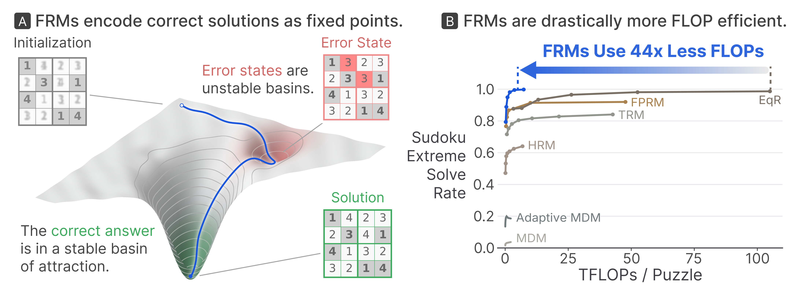

  

  <small>Alec Helbling · Andrey Bryutkin · Mauro Martino · Duen Horng (Polo) Chau · Nima Dehmamy · Hendrik Strobelt</small>

  <a href="https://arxiv.org/abs/2606.29150"><strong>Paper</strong></a>

  

  <em>FRMs shape correct solutions into stable attractors and reach EqR’s peak Sudoku-Extreme solve rate with 44× fewer inference FLOPs.</em>

> [!NOTE]
> Implementation coming soon.
